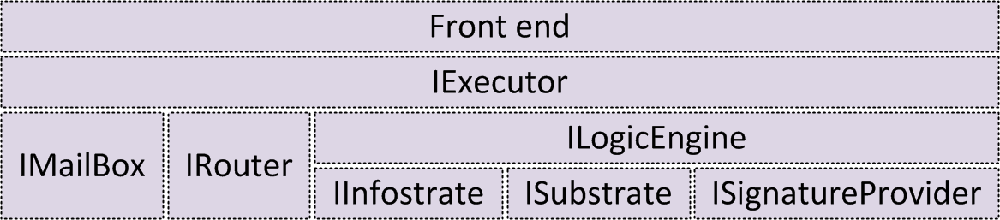
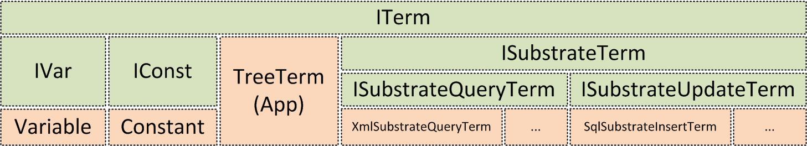

# DKAL Engine High Level Architecture

This section introduces and discusses the high level architecture of the DKAL engine implementation.

## DKAL Functionality Modules
The following diagram shows how the different main engine modules are layered from the front end to the data providers ({{ISubstrate}}, {{IInfostrate}}, etc.).

**Legend:** each box depends on the boxes that are sitting below it.

As the names might suggest, these boxes represent interfaces rather than modules. We will use the word "module" to refer to an interface and to an interface implementation, unless the context forces us to make a real distinction between the two.

In the rest of this section, we introduce each of these modules and briefly explain its main responsibilities:
* **Front end:** As we discussed in the [section on using DKAL](UsingDKAL), there are different front ends (GUI, console, etc.). The front end is responsible for getting whatever arguments are necessary from the user (e.g., where the policy file is), parse all necessary files (e.g., policy files, routing table files) and creating an executor (or more than one, in the case of the multi-principal front end) that will carry on with the policy execution.
* **{{IExecutor}}:** The {{IExecutor}} module is in charge of running a principal's policy. It will iterate over the rules and accumulate pending actions such as sending messages to other principals or installing new rules. It will then apply those actions. In order to execute each rule, the {{IExecutor}} module resorts to the {{ILogicEngine}} in order to solve the {{if}} conditions and to the {{IMailBox}} to solve the {{upon}} conditions.
* **{{IMailBox}}:** The {{IMailBox}} module stores all the incoming messages that the {{IExecutor}} collects from the {{IRouter}}. The {{IMailBox}} checks the evidence (if present) on incoming messages. Once stored, messages can be queried using infon patterns. From time to time, a {{prune}} operation must be invoked over the {{IMailBox}} in order to eliminate old and/or unnecessary messages. The {{drop}} action is used to explicitly eliminate messages from the {{IMailBox}}.
* **{{IRouter}}:** The {{IRouter}} module is used by the {{IExecutor}} to interact with the outside world. It sends and receives infon messages. It can be implemented using different concrete mechanisms such as web services for the case of trying to reach principals located remotely or using shared memory for the case of multi-principal execution in the same computer.
* **{{ILogicEngine}}:** The {{ILogicEngine}} module is in charge of performing the infon logic reasoning. It can be queried using infon patterns and it responds using the knowledge stored in its {{IInfostrate}}. It can also produce proofs (or evidence), in which case it uses the {{ISignatureProvider}} to sign statements. Finally, it uses different {{ISubstrate}} connections to query data sitting on different data providers such as SQL databases or XML files.
* **{{IInfostrate}}:** The {{IInfostrate}} module is an infon database that contains the knowledge of the principal. The {{learn}} action adds an infon to the {{IInfostrate}}; the {{forget}} action removes an infon from it.
* **{{ISubstrate}}:** The {{ISubstrate}} module is a general interface for different sources of information that the {{ILogicEngine}} can consume in order to derive infons. It is invoked whenever an {{asInfon}} term is found by the {{ILogicEngine}}. The way each {{ISubstrate}} implementation works can be very different internally, but from an interface point of view they all return their results by means of substitutions.
* **{{ISignatureProvider}}:** The {{ISignatureProvider}} module constructs and verifies digital signatures. It is used by the {{ILogicEngine}} to construct and to check evidence. Different module implementations may use different signature algorithms and may obtain the public/private keys from different locations such as loading them from certificate stores, reading them from a specialized configuration file, asking the user via dialogs, etc.

## DKAL Abstract Syntax Modules
The DKAL abstract syntax or AST (for Abstract Syntax Tree) is implemented by means of a series of interfaces. The following diagram shows most of these:

**Legend:** the green boxes represent interfaces; the orange boxes represent concrete classes that implement the interfaces they have on top.

In the rest of this section we introduce each of these interfaces and classes.

### DKAL Abstract Syntax Interfaces
* **{{ITerm}}:** The main interface for the abstract syntax representation is the {{ITerm}} interface. It requires a number of operations that the {{ITerm}} needs to support, such as querying its DKAL type (see [DKAL types](SyntaxBasic#syntaxBasicTypes)), applying a substitution to it, unifying it with other {{ITerm}}, etc.
* **{{IVar}}:** This interface is implemented by terms that represent variables. On top of the {{ITerm}} operations, an {{IVar}} needs to have a name.
* **{{IConst}}:** This interface is implemented by terms that represent constants. Besides supporting the {{ITerm}} operations, an {{IConst}} carries a value.
* **{{ISubstrateTerm}}:** An {{ISubstrateTerm}} element is an {{ITerm}} that has a pointer to a namespace (see [substrate query terms](SyntaxBasic#syntaxBasicSubstrateQuery)). This namespace indicates the engine which substrate (if any) is capable of understanding this term and perform some operation with it. 
* **{{ISubstrateQueryTerm}}:** An {{ISubstrateQueryTerm}} is a kind of {{ISubstrateTerm}} that encodes a query (such as an XPath expression) over a substrate. In terms of interface {{ISubstrateQueryTerm}} is just an empty interface extending {{ISubstrateTerm}}.
* **{{ISubstrateUpdateTerm}}:** An {{ISubstrateUpdateTerm}} is a kind of {{ISubstrateTerm}} that encodes an update operation (such as row insertion) over a substrate. Just like {{ISubstrateQueryTerm}}, in terms of interface {{ISubstrateUpdateTerm}} is an empty interface extending {{ISubstrateTerm}}.

### DKAL Abstract Syntax Classes
* **{{Variable}}:** This is the canonic implementation of the {{IVar}} interface. The engine uses only this implementation in its current stage, but splitting interface from implementation allows to introduce others.
* **{{Constant}}:** Just like {{Variable}}, this is the canonic implementation of the {{IConst}} interface. It contains a .NET {{object}} to keep the value of interest (an integer, a string, etc.). Using a .NET {{object}} allows the DKAL engine to refer to any .NET type.
* **{{TreeTerm}}:** The {{Application}} term is a class used to represent inner nodes in the parse tree. It has a pointer to a function and a list of concrete parameters. The function specifies a name, a list of parameter DKAL types and a return DKAL type. The list of the concrete arguments DKAL types must match the list of the function parameter DKAL types. For instance, an {{Application}} instance may encode the conjunction of two infons ({{App(conjunction, [i1;i2](i1;i2))}}), the sum of 4 integers ({{App(sum,[1;2;5;27](1;2;5;27))}}), and many other things.

Most of the other classes (such as queries) are implemented using {{Application}} terms. For instance, a basic query may require that {{X == 3 || X == 4}}; this is encoded as {{App(or,[App(eq,[X;3](App(eq,[X;3));App(eq,[X;4](X;4))])}}.

### Substitutions
Substitutions play an important role in DKAL. They are esentially an assigment of terms to variables; more concretely, a mapping of {{IVar}} to {{ITerm}}. Substitutions are defined in the {{ISubstitution}} interface.

When querying different substrates the results may be very different. For instance, asking a basic substrate to perform an arithmetic operation (e.g., {{{| "basic" | Y := 2 + 2 |}}}) will yield a single result; whereas querying a SQL database (e.g., {{{ "records" | records.id == X && records.age > 10}}}) may return a myriad of values. By assigning values to the free variables in the query, a substitution provides an easy way to return results in any of these scenarios. More concretely, we use sequences of substitutions as a result of many operations:
* If the operation has no results, it will return an empty sequence of substitutions. {{}}
* If it has a single result, it will return a sequence of substitutions of size 1, with a single substitution containing the result. {{[{Y --> 4}]({Y---_-4})}}
* Otherwise, it will lazily return all substitutions (read more about [lazyness and F# sequences](http://msdn.microsoft.com/en-us/library/dd233209.aspx)). {{[{X --> 33}; {X --> 98}; {X --> 105}]({X---_-33};-{X---_-98};-{X---_-105})}}
Notice how this approach also enables us to model operations with boolean result:
* True is represented by a sequence of substitutions with a single element, the identity substitution (a substitution which does not map any variable to any term).
* False is represented by an empty sequence of substitutions.